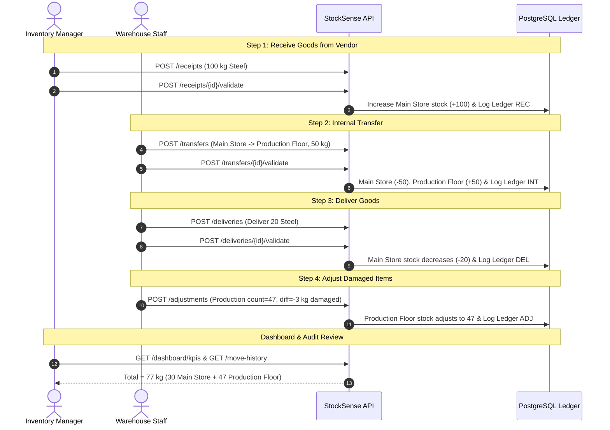

# StockSense IMS — Complete API Documentation

> Complete REST API reference for **StockSense**, an enterprise Inventory Management System (IMS). Built with **FastAPI**, **SQLAlchemy**, and **PostgreSQL**.

---

## 📌 General Information

- **Base URL**: `http://localhost:8000`
- **API Version 1 Prefix**: `/api/v1`
- **Interactive Swagger Docs**: `http://localhost:8000/docs`
- **ReDoc Interactive Specs**: `http://localhost:8000/redoc`
- **Default Port**: `8000`

---

## 🔒 Authentication & Headers

Protected endpoints require a JWT Bearer Token in the HTTP `Authorization` header:

```http
Authorization: Bearer <your_jwt_access_token>
```

### Standard Response Envelope (`ApiResponse`)
Most responses follow a unified wrapper structure:

```json
{
  "success": true,
  "message": "Operation description",
  "data": { ... }
}
```

### Standard Paginated Envelope (`PaginatedResponse`)
Endpoints returning lists with pagination wrap data inside `items`, `total`, `page`, `page_size`, and `total_pages`:

```json
{
  "success": true,
  "message": "Items retrieved",
  "data": {
    "items": [ ... ],
    "total": 45,
    "page": 1,
    "page_size": 20,
    "total_pages": 3
  }
}
```

---

## 📋 Table of Contents

1. [System & Health Check](#1-system--health-check)
2. [Authentication & Profile](#2-authentication--profile)
3. [Dashboard & KPIs](#3-dashboard--kpis)
4. [Products & Stock Availability](#4-products--stock-availability)
5. [Product Categories](#5-product-categories)
6. [Warehouses & Locations (Settings)](#6-warehouses--locations-settings)
7. [Operations: Receipts (Incoming Goods)](#7-operations-receipts-incoming-goods)
8. [Operations: Delivery Orders (Outgoing Goods)](#8-operations-delivery-orders-outgoing-goods)
9. [Operations: Internal Transfers](#9-operations-internal-transfers)
10. [Operations: Stock Adjustments](#10-operations-stock-adjustments)
11. [Move History & Stock Ledger](#11-move-history--stock-ledger)
12. [Step-by-Step Business Flow Example](#12-step-by-step-business-flow-example)

---

## 1. System & Health Check

### Health Check
- **Endpoint**: `GET /`
- **Auth**: None
- **Description**: Verifies service status, database connectivity, and provides basic metadata.

**Response Example (200 OK)**:
```json
{
  "status": "online",
  "app_name": "StockSense - Modern Inventory Management System",
  "version": "1.0.0",
  "environment": "development",
  "database_status": "connected",
  "docs_url": "/docs",
  "redoc_url": "/redoc",
  "api_v1": "/api/v1"
}
```

---

## 2. Authentication & Profile

Base route: `/api/v1/auth`

### 2.1 Sign Up
- **Method**: `POST /api/v1/auth/signup`
- **Auth**: None
- **Request Body**:
```json
{
  "name": "Sarah Connor",
  "email": "sarah.connor@example.com",
  "password": "SecurePassword@123",
  "role": "inventory_manager"
}
```
*Allowed roles: `inventory_manager`, `warehouse_staff`, `admin`.*

**Response (201 Created)**:
```json
{
  "success": true,
  "message": "User account created successfully.",
  "data": {
    "id": 1,
    "name": "Sarah Connor",
    "email": "sarah.connor@example.com",
    "role": "inventory_manager",
    "is_active": true,
    "created_at": "2026-09-26T12:00:00Z"
  }
}
```

---

### 2.2 Login
- **Method**: `POST /api/v1/auth/login`
- **Auth**: None
- **Request Body**:
```json
{
  "email": "sarah.connor@example.com",
  "password": "SecurePassword@123"
}
```

**Response (200 OK)**:
```json
{
  "success": true,
  "message": "Login successful.",
  "data": {
    "access_token": "eyJhbGciOiJIUzI1NiIsInR5cCI6IkpXVCJ9...",
    "token_type": "bearer",
    "user": {
      "id": 1,
      "name": "Sarah Connor",
      "email": "sarah.connor@example.com",
      "role": "inventory_manager",
      "is_active": true,
      "created_at": "2026-09-26T12:00:00Z"
    }
  }
}
```

---

### 2.3 Forgot Password (Request OTP)
- **Method**: `POST /api/v1/auth/forgot-password`
- **Auth**: None
- **Description**: Generates a 6-digit numeric OTP code valid for 10 minutes.
- **Request Body**:
```json
{
  "email": "sarah.connor@example.com"
}
```

**Response (200 OK)**:
```json
{
  "success": true,
  "message": "OTP for password reset generated successfully.",
  "data": {
    "email": "sarah.connor@example.com",
    "expires_in_minutes": 10,
    "dev_otp": "492817"
  }
}
```

---

### 2.4 Verify OTP
- **Method**: `POST /api/v1/auth/verify-otp`
- **Auth**: None
- **Request Body**:
```json
{
  "email": "sarah.connor@example.com",
  "otp": "492817"
}
```

**Response (200 OK)**:
```json
{
  "success": true,
  "message": "OTP verified successfully. You may now reset your password.",
  "data": {
    "email": "sarah.connor@example.com",
    "verified": true
  }
}
```

---

### 2.5 Reset Password
- **Method**: `POST /api/v1/auth/reset-password`
- **Auth**: None
- **Request Body**:
```json
{
  "email": "sarah.connor@example.com",
  "otp": "492817",
  "new_password": "BrandNewPassword@456"
}
```

**Response (200 OK)**:
```json
{
  "success": true,
  "message": "Password has been reset successfully. You can now login with your new password.",
  "data": {
    "email": "sarah.connor@example.com"
  }
}
```

---

### 2.6 Get Profile (Me)
- **Method**: `GET /api/v1/auth/me`
- **Auth**: Bearer Token
- **Response (200 OK)**: Returns profile of logged-in user.

---

### 2.7 Update Profile
- **Method**: `PUT /api/v1/auth/me`
- **Auth**: Bearer Token
- **Request Body**:
```json
{
  "name": "Sarah Connor-Smith",
  "password": "OptionalUpdatedPassword@789"
}
```

---

### 2.8 Logout
- **Method**: `POST /api/v1/auth/logout`
- **Auth**: Bearer Token

---

## 3. Dashboard & KPIs

Base route: `/api/v1/dashboard`

### 3.1 Get Dashboard KPIs
- **Method**: `GET /api/v1/dashboard/kpis`
- **Auth**: Optional / Public
- **Description**: Returns a consolidated snapshot of inventory operations, low-stock alerts, pending activities, and recent ledger entries.

**Response (200 OK)**:
```json
{
  "success": true,
  "message": "Dashboard KPIs computed successfully.",
  "data": {
    "total_products": 24,
    "total_stock_units": 1540.0,
    "low_stock_items_count": 3,
    "out_of_stock_items_count": 1,
    "pending_receipts_count": 2,
    "pending_deliveries_count": 4,
    "internal_transfers_scheduled_count": 1,
    "completed_operations_count": 38,
    "low_stock_items": [
      {
        "product_id": 4,
        "product_name": "Industrial Screws (M8)",
        "sku": "SKU-SCREW-M8",
        "category_name": "Hardware & Parts",
        "current_stock": 40.0,
        "min_stock_level": 200.0,
        "reorder_quantity": 500.0,
        "uom": "pcs",
        "deficit": 160.0
      }
    ],
    "recent_movements": [ ... ]
  }
}
```

---

### 3.2 Dynamic Document Filter
- **Method**: `GET /api/v1/dashboard/documents`
- **Auth**: Optional / Public
- **Query Parameters**:
  - `document_type`: `receipt` | `delivery` | `internal` | `adjustment` | `all`
  - `status`: `draft` | `waiting` | `ready` | `done` | `canceled`
  - `warehouse_id`: integer
  - `location_id`: integer
  - `category_id`: integer
  - `search`: string (matches reference, vendor, customer, reason)
  - `page`: integer (default: 1)
  - `page_size`: integer (default: 20)

**Response (200 OK)**:
```json
{
  "success": true,
  "message": "Found 12 documents matching dynamic filter criteria.",
  "data": {
    "items": [
      {
        "id": 1,
        "reference_number": "REC-20260926-A1B2",
        "document_type": "receipt",
        "status": "done",
        "partner_or_type": "Vendor: Apex Metals Corp",
        "location_name": "Main Store",
        "warehouse_name": "Main Warehouse",
        "item_count": 2,
        "total_quantity": 100.0,
        "created_at": "2026-09-26T12:10:00Z",
        "validated_at": "2026-09-26T12:15:00Z"
      }
    ],
    "total": 12,
    "page": 1,
    "page_size": 20,
    "total_pages": 1
  }
}
```

---

## 4. Products & Stock Availability

Base route: `/api/v1/products`

### 4.1 List Products
- **Method**: `GET /api/v1/products`
- **Query Parameters**:
  - `search`: string (matches SKU or Name)
  - `category_id`: integer
  - `low_stock_only`: boolean (default: false)
  - `out_of_stock_only`: boolean (default: false)

**Response (200 OK)**:
```json
{
  "success": true,
  "message": "Products retrieved successfully.",
  "data": [
    {
      "id": 1,
      "name": "Steel Rods",
      "sku": "SKU-STEEL-ROD",
      "category_id": 1,
      "category_name": "Raw Materials",
      "uom": "kg",
      "cost_price": 45.0,
      "selling_price": 65.0,
      "min_stock_level": 50.0,
      "max_stock_level": 500.0,
      "reorder_quantity": 100.0,
      "total_stock": 77.0,
      "is_low_stock": false,
      "is_out_of_stock": false,
      "is_active": true,
      "created_at": "2026-09-26T10:00:00Z",
      "updated_at": "2026-09-26T10:00:00Z"
    }
  ]
}
```

---

### 4.2 Create Product
- **Method**: `POST /api/v1/products`
- **Auth**: Bearer Token
- **Request Body**:
```json
{
  "name": "Steel Rods",
  "sku": "SKU-STEEL-ROD",
  "category_id": 1,
  "uom": "kg",
  "description": "High tensile steel rods 10mm",
  "cost_price": 45.0,
  "selling_price": 65.0,
  "min_stock_level": 50.0,
  "max_stock_level": 500.0,
  "reorder_quantity": 100.0,
  "initial_stock": 100.0,
  "initial_location_id": 1
}
```
*Note: If `initial_stock` is provided, the API automatically updates the location balance and logs an `initial_stock` entry in the Stock Ledger.*

---

### 4.3 Low Stock Alerts
- **Method**: `GET /api/v1/products/alerts/low-stock`
- **Description**: Lists all products where `total_stock <= min_stock_level`.

---

### 4.4 Get Product Details (with Location Stock Breakdown)
- **Method**: `GET /api/v1/products/{product_id}`
- **Response (200 OK)**:
```json
{
  "success": true,
  "data": {
    "id": 1,
    "name": "Steel Rods",
    "sku": "SKU-STEEL-ROD",
    "total_stock": 77.0,
    "stock_by_location": [
      {
        "location_id": 1,
        "location_name": "Main Store",
        "warehouse_id": 1,
        "warehouse_name": "Main Warehouse",
        "quantity": 30.0,
        "reserved_quantity": 0.0
      },
      {
        "location_id": 2,
        "location_name": "Production Floor",
        "warehouse_id": 1,
        "warehouse_name": "Main Warehouse",
        "quantity": 47.0,
        "reserved_quantity": 0.0
      }
    ]
  }
}
```

---

### 4.5 Stock Availability by Location
- **Method**: `GET /api/v1/products/{product_id}/stock`

---

### 4.6 Update Product
- **Method**: `PUT /api/v1/products/{product_id}`
- **Auth**: Bearer Token

---

### 4.7 Delete / Deactivate Product
- **Method**: `DELETE /api/v1/products/{product_id}`
- **Auth**: Bearer Token

---

## 5. Product Categories

Base route: `/api/v1/categories`

| Method | Endpoint | Description |
| :--- | :--- | :--- |
| `GET` | `/api/v1/categories` | List all categories |
| `POST` | `/api/v1/categories` | Create category (`name`, `code`, `description`) |
| `GET` | `/api/v1/categories/{id}` | Get category details |
| `PUT` | `/api/v1/categories/{id}` | Update category |
| `DELETE` | `/api/v1/categories/{id}` | Delete category (blocked if products linked) |

---

## 6. Warehouses & Locations (Settings)

### 6.1 Warehouses (`/api/v1/warehouses`)
- `GET /api/v1/warehouses`: List warehouses with their location counts.
- `POST /api/v1/warehouses`: Create warehouse (`name`, `code`, `address`, `city`).
- `GET /api/v1/warehouses/{id}`: Get warehouse by ID.
- `PUT /api/v1/warehouses/{id}`: Update warehouse.
- `DELETE /api/v1/warehouses/{id}`: Delete warehouse.

### 6.2 Locations (`/api/v1/locations`)
- `GET /api/v1/locations?warehouse_id=1&location_type=internal`: List locations with optional filters.
- `POST /api/v1/locations`: Create location.
  ```json
  {
    "warehouse_id": 1,
    "name": "Rack B",
    "code": "LOC-RACKB",
    "location_type": "internal"
  }
  ```
- `GET /api/v1/locations/{id}`: Get location details.
- `PUT /api/v1/locations/{id}`: Update location.
- `DELETE /api/v1/locations/{id}`: Delete location (fails if stock quantity exists).

---

## 7. Operations: Receipts (Incoming Goods)

Base route: `/api/v1/receipts`

Used when items arrive from vendors.

### 7.1 Create Receipt
- **Method**: `POST /api/v1/receipts`
- **Auth**: Bearer Token
- **Request Body**:
```json
{
  "supplier_name": "Apex Metals Corp",
  "destination_location_id": 1,
  "scheduled_date": "2026-09-30T10:00:00Z",
  "notes": "Incoming batch of steel bars",
  "items": [
    {
      "product_id": 1,
      "quantity_expected": 100.0,
      "quantity_received": 100.0
    }
  ]
}
```

### 7.2 Validate Receipt
- **Method**: `POST /api/v1/receipts/{receipt_id}/validate`
- **Auth**: Bearer Token
- **Effect**:
  1. Sets receipt status to `done`.
  2. Automatically **increases stock** in `StockQuant` for destination location.
  3. Appends an entry into `StockLedger` (Move History) with type `receipt`.

### 7.3 Other Receipt Endpoints
- `GET /api/v1/receipts`: Filter by `status`, `location_id`, `supplier`.
- `GET /api/v1/receipts/{id}`: Get receipt and item lines.
- `PUT /api/v1/receipts/{id}`: Edit draft receipt.
- `POST /api/v1/receipts/{id}/cancel`: Cancel receipt.

---

## 8. Operations: Delivery Orders (Outgoing Goods)

Base route: `/api/v1/deliveries`

Used when stock leaves the warehouse for customer shipment.

### 8.1 Create Delivery Order
- **Method**: `POST /api/v1/deliveries`
- **Auth**: Bearer Token
- **Request Body**:
```json
{
  "customer_name": "MegaCorp Logistics",
  "source_location_id": 1,
  "shipping_address": "742 Evergreen Terrace",
  "notes": "Express delivery order",
  "items": [
    {
      "product_id": 1,
      "quantity_demand": 20.0,
      "quantity_done": 20.0
    }
  ]
}
```

### 8.2 Three-Stage Warehouse Dispatch Workflow
1. **Pick**: `POST /api/v1/deliveries/{id}/pick` (status transitions to `waiting`).
2. **Pack**: `POST /api/v1/deliveries/{id}/pack` (status transitions to `ready`).
3. **Validate**: `POST /api/v1/deliveries/{id}/validate`
   - Checks available stock.
   - Automatically **decreases stock** at source location.
   - Logs entry in `StockLedger` with type `delivery`.
   - Sets status to `done`.

### 8.3 Other Delivery Endpoints
- `GET /api/v1/deliveries`: Filter by `status`, `location_id`, `customer`.
- `GET /api/v1/deliveries/{id}`: Get order details and items.
- `PUT /api/v1/deliveries/{id}`: Edit draft delivery.
- `POST /api/v1/deliveries/{id}/cancel`: Cancel delivery order.

---

## 9. Operations: Internal Transfers

Base route: `/api/v1/transfers`

Used to move stock inside the company (e.g. Main Store → Production Floor, Rack A → Rack B, Warehouse 1 → Warehouse 2).

### 9.1 Create Internal Transfer
- **Method**: `POST /api/v1/transfers`
- **Auth**: Bearer Token
- **Request Body**:
```json
{
  "source_location_id": 1,
  "destination_location_id": 2,
  "notes": "Move steel to production floor",
  "items": [
    {
      "product_id": 1,
      "quantity": 50.0
    }
  ]
}
```

### 9.2 Validate Internal Transfer
- **Method**: `POST /api/v1/transfers/{id}/validate`
- **Auth**: Bearer Token
- **Effect**:
  - Decreases stock at source location.
  - Increases stock at destination location.
  - **Company aggregate stock remains unchanged.**
  - Logs entry in `StockLedger` (type `internal_transfer`).
  - Sets status to `done`.

---

## 10. Operations: Stock Adjustments

Base route: `/api/v1/adjustments`

Fix mismatches between recorded inventory and physical count (e.g., damaged items, theft, audit reconciliation).

### 10.1 Create & Apply Adjustment
- **Method**: `POST /api/v1/adjustments`
- **Auth**: Bearer Token
- **Request Body**:
```json
{
  "product_id": 1,
  "location_id": 2,
  "counted_quantity": 47.0,
  "reason": "3 kg steel damaged during cutting",
  "notes": "Scrapped damaged material",
  "auto_validate": true
}
```

**Response (201 Created)**:
```json
{
  "success": true,
  "message": "Stock adjustment ADJ-20260926-8F2B created and applied immediately.",
  "data": {
    "id": 1,
    "reference_number": "ADJ-20260926-8F2B",
    "product_id": 1,
    "product_name": "Steel Rods",
    "recorded_quantity": 50.0,
    "counted_quantity": 47.0,
    "difference_quantity": -3.0,
    "reason": "3 kg steel damaged during cutting",
    "status": "done"
  }
}
```

---

## 11. Move History & Stock Ledger

Base route: `/api/v1/move-history`

Provides an immutable audit log recording every single stock movement across the enterprise.

### Query Stock Ledger
- **Method**: `GET /api/v1/move-history`
- **Auth**: Optional / Public
- **Query Parameters**:
  - `product_id`: integer
  - `location_id`: integer (matches either source or destination)
  - `warehouse_id`: integer
  - `move_type`: `receipt` | `delivery` | `internal_transfer` | `inventory_adjustment` | `initial_stock`
  - `reference`: string (document number)
  - `search`: string
  - `start_date`: ISO datetime
  - `end_date`: ISO datetime
  - `page`: integer
  - `page_size`: integer

**Response (200 OK)**:
```json
{
  "success": true,
  "message": "Stock ledger entries retrieved.",
  "data": {
    "items": [
      {
        "id": 4,
        "timestamp": "2026-09-26T12:30:00Z",
        "reference_number": "ADJ-20260926-8F2B",
        "move_type": "inventory_adjustment",
        "product_id": 1,
        "product_name": "Steel Rods",
        "product_sku": "SKU-STEEL-ROD",
        "uom": "kg",
        "from_location_id": 2,
        "from_location_name": "Production Floor",
        "from_warehouse_name": "Main Warehouse",
        "to_location_id": null,
        "quantity": 3.0,
        "notes": "Adjustment: recorded=50.0, counted=47.0, diff=-3.0. Reason: 3 kg steel damaged."
      },
      {
        "id": 3,
        "timestamp": "2026-09-26T12:20:00Z",
        "reference_number": "DEL-20260926-0001",
        "move_type": "delivery",
        "product_id": 1,
        "from_location_name": "Main Store",
        "to_location_name": null,
        "quantity": 20.0
      },
      {
        "id": 2,
        "timestamp": "2026-09-26T12:15:00Z",
        "reference_number": "INT-20260926-0001",
        "move_type": "internal_transfer",
        "product_id": 1,
        "from_location_name": "Main Store",
        "to_location_name": "Production Floor",
        "quantity": 50.0
      },
      {
        "id": 1,
        "timestamp": "2026-09-26T12:00:00Z",
        "reference_number": "REC-20260926-0001",
        "move_type": "receipt",
        "product_id": 1,
        "from_location_name": null,
        "to_location_name": "Main Store",
        "quantity": 100.0
      }
    ],
    "total": 4,
    "page": 1,
    "page_size": 20,
    "total_pages": 1
  }
}
```

---

## 12. Step-by-Step Business Flow Example

Here is how the lifecycle from the problem statement is mirrored directly in API calls:


